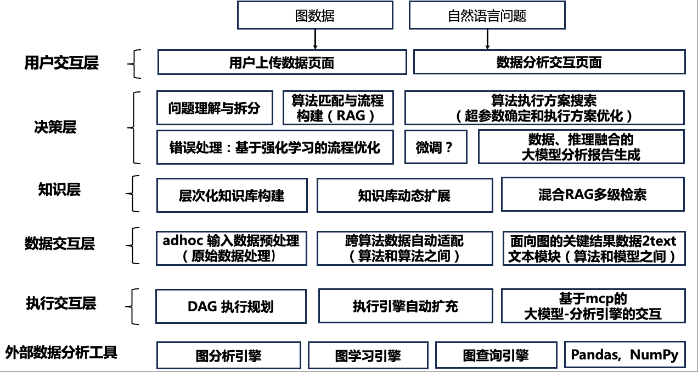

# AAG: 分析增强生成框架

## 项目简介


AAG（Analytics Augmented Generation Engine）是一个端到端的分析增强生成框架，旨在提升大语言模型（LLM）在图结构数据处理与分析方面的能力。该框架通过集成图分析系统、RAG（Retrieval-Augmented Generation）知识层和大模型推理，实现了从任意数据到图建模、图分析、专业问题建模与总结的全流程自动化，助力解决复杂的图相关问题。

---

## 核心特性

- **图计算引擎**：支持多种图算法（PageRank、连通分量、中心性等），基于 NetworkX 和 PyTorch Geometric
- **混合检索**：结合图检索（NebulaGraph）和向量检索（Milvus）的优势，提供更精准的知识检索
- **智能问题建模**：将领域问题自动转化为图分析任务，支持复杂依赖的多任务流水线
- **知识库增强**：集成领域知识库，提升 LLM 对图结构问题的理解与推理能力
- **灵活数据支持**：支持图数据（graph）、表格数据（table）、文本数据（text）等多种数据源
- **多种运行模式**：支持交互式对话、批处理等多种使用方式
- **配置驱动**：通过 YAML 配置文件灵活配置系统参数

---

## 架构总览



### 核心组件

#### 1. **AAG Engine (分析增强生成引擎)**
- 端到端的任务调度和协调
- 问题理解和任务分解
- 多组件协同工作

#### 2. **Computing Engine (图计算引擎)**
- **NetworkX 引擎**：支持经典图算法（BFS、DFS、PageRank、中心性等）
- **PyTorch Geometric 引擎**：支持图神经网络和深度学习算法
- 通过 MCP (Model Context Protocol) 实现动态算法注册和执行

#### 3. **Expert Search Engine (专家搜索引擎)**
- **图检索**：基于 NebulaGraph 的 k-hop 子图检索
- **向量检索**：基于 Milvus 的语义相似度检索
- **知识增强**：结合外部知识库提升检索质量

#### 4. **Data Pipeline (数据处理管道)**
- 支持多种数据格式（CSV、JSON、YAML、GML 等）
- 自动图结构抽取
- 数据加载和转换

#### 5. **Reasoner (推理模块)**
- 支持多种 LLM 后端（Ollama、OpenAI）
- 专业问题建模和结果总结
- 可配置的提示词模板

#### 6. **Knowledge Base (知识库)**
- 算法知识库：定义图算法和其使用场景
- 领域知识库：存储领域相关的专业知识
- 支持层次化知识组织

---

## 快速开始

### 1. 环境准备

#### Python 版本要求

- **Python >= 3.11**

请确保您的 Python 版本满足要求。可以通过以下命令检查：

```bash
python --version
# 或
python3 --version
```

#### 安装依赖

```bash
pip install -r requirements.txt
```

#### 启动必要服务

**NebulaGraph (图数据库)**
```bash
docker run -d --name nebula-graphd \
  -p 9669:9669 -p 19669:19669 \
  vesoft/nebula-graphd:v3.4.0
```

**Milvus (向量数据库)**
```bash
docker run -d --name milvus-standalone \
  -p 19530:19530 -p 9091:9091 \
  milvusdb/milvus:v2.3.3
```

**Ollama (可选，本地 LLM)**
```bash
ollama serve
ollama pull llama3.1:70b
```

### 2. 配置系统

编辑 `config/engine_config.yaml` 配置文件：

```yaml
# 运行模式： interactive / batch
mode: interactive

# 推理模块配置
reasoner:
  llm:
    provider: "openai"  # ollama 或 openai
    openai:
      base_url: "https://your-api-endpoint/v1/"
      api_key: "your-api-key"
      model: "gpt-4o-mini"

# 检索模块配置
retrieval:
  database:
    graph:
      space_name: "AMLSim1K"
      server_ip: "127.0.0.1"
      server_port: "9669"
    vector:
      collection_name: "graphllm_collection"
      host: "localhost"
      port: 19530
  embedding:
    model_name: "BAAI/bge-large-en-v1.5"
    device: "cuda:2"
  rag:
    graph:
      k_hop: 2
    vector:
      k_similarity: 5
```

### 3. 数据准备

在 `config/data_upload_config.yaml` 中配置数据集：

```yaml
datasets:
  - name: AMLSim1K
    type: graph
    schema:
      vertex:
        - type: account
          path: "/path/to/accounts.csv"
          format: csv
          id_field: acct_id
      edge:
        - type: transfer
          path: "/path/to/transactions.csv"
          format: csv
          source_field: orig_acct
          target_field: bene_acct
```

### 4. 运行系统

```bash
# 进入项目目录
cd aag

# 启动交互模式
python main.py
```

### 5. 使用示例

启动后，系统进入交互模式，支持以下命令：

```
👤 用户 > help                    # 显示帮助
👤 用户 > datasets                # 列出可用数据集
👤 用户 > use AMLSim1K           # 选择数据集
👤 用户 > 分析这个图中的重要节点  # 提出问题
👤 用户 > quit                   # 退出
```

---

## 目录结构

```
GraphLLM/
├── aag/                          # 核心代码目录
│   ├── main.py                   # 主入口文件
│   ├── engine/                   # AAG 引擎
│   │   ├── aag_engine.py         # 引擎核心
│   │   └── scheduler.py          # 任务调度器
│   ├── computing_engine/         # 图计算引擎
│   │   ├── graph_processor.py    # 图处理器
│   │   ├── networkx_server/      # NetworkX 服务
│   │   └── pyg_server/           # PyTorch Geometric 服务
│   ├── expert_search_engine/     # 专家搜索引擎
│   │   ├── rag.py                # RAG 核心
│   │   ├── database/             # 数据库接口
│   │   │   ├── nebulagraph.py    # NebulaGraph
│   │   │   └── milvus.py         # Milvus
│   │   └── data_process/         # 数据处理
│   ├── data_pipeline/            # 数据处理管道
│   │   ├── data_transformer/     # 数据转换器
│   │   └── knowledge_ingestion/  # 知识抽取
│   ├── reasoner/                 # 推理模块
│   │   ├── model_deployment.py   # LLM 部署
│   │   └── prompt_template/      # 提示词模板
│   ├── knowledge_base/           # 知识库
│   │   ├── algorithms.yaml       # 算法定义
│   │   ├── knowledge.yaml        # 知识定义
│   │   └── task_types.yaml       # 任务类型
│   ├── models/                   # 模型定义
│   │   └── graph_workflow_dag.py # 工作流 DAG
│   └── utils/                    # 工具函数
├── config/                       # 配置文件
│   ├── engine_config.yaml        # 引擎配置
│   └── data_upload_config.yaml   # 数据配置
├── datasets/                     # 数据集目录
│   ├── graphs/                   # 图数据集
│   └── papers/                   # 论文数据
├── requirements.txt              # 依赖列表
└── README.md                     # 本文档
```

---

## 主要功能

### 1. 图数据自动抽取

支持从多种数据源自动构建图结构：

- **表格数据**：从 CSV/Excel 文件中提取节点和边
- **文本数据**：从文本中抽取实体和关系
- **已有图数据**：直接加载 GML、GraphML 等格式

### 2. 灵活的图算法执行

内置多种常用图算法，支持：

- **遍历算法**：BFS、DFS
- **中心性算法**：度中心性、接近中心性、介数中心性、特征向量中心性
- **社区检测**：Louvain 社区检测
- **路径算法**：最短路径、所有路径
- **其他算法**：PageRank、连通分量等

### 3. RAG 知识增强

- **图检索**：基于问题在图中检索相关子图
- **向量检索**：基于语义相似度检索相关知识文档
- **知识融合**：结合多种知识源提升回答质量

### 4. 专业问题建模与总结

- 自动将自然语言问题转化为图分析任务
- 支持复杂多步骤的分析流程
- 生成专业级的分析报告

### 5. 多任务依赖与流水线

支持复杂的工作流编排：

- 自动识别任务依赖关系
- 构建执行 DAG
- 并行执行独立任务

---

## 使用场景

- **金融风控**：关系网络分析、异常交易检测
- **知识图谱**：自动构建与推理
- **社交网络**：社区发现、影响力分析
- **供应链分析**：网络建模与优化
- **学术研究**：图算法研究与实验

---

## 扩展性与定制化

### 添加自定义图算法

在 `aag/knowledge_base/algorithms.yaml` 中定义新算法：

```yaml
- id: custom_algorithm
  task_type_id: custom_task
  description:
    principle: "算法原理描述"
    meaning: "算法意义和应用场景"
  support_engines: networkx
  inputSchema:
    parameters:
      graph:
        type: graph
        required: true
  output:
    type: dict
    description: "输出格式"
```

### 添加新的数据源

在 `aag/data_pipeline/data_transformer/` 中实现新的数据加载器。

### 集成新的 LLM

在 `aag/reasoner/model_deployment.py` 中添加新的 LLM 接口。

---

## 配置说明

### 引擎配置 (engine_config.yaml)

主要配置项：

- **mode**: 运行模式（interactive/batch）
- **reasoner**: LLM 配置（模型、API 密钥等）
- **retrieval**: 检索配置（数据库连接、RAG 参数等）
- **monitoring**: 性能监控配置

### 数据配置 (data_upload_config.yaml)

数据配置结构：

- **datasets**: 数据集列表
  - **name**: 数据集名称
  - **type**: 数据类型（graph/table/text）
  - **schema**: 数据模式定义（节点、边、属性等）

详细配置说明请参考配置文件中的注释。

---

## 性能优化建议

1. **硬件配置**：
   - GPU：NVIDIA RTX 4090 或更高
   - 内存：32GB+ RAM
   - 存储：SSD 用于向量索引

2. **参数调优**：
   - 调整 `k_hop` 控制图检索范围
   - 调整 `k_similarity` 控制向量检索数量
   - 优化批处理大小提升吞吐量

3. **缓存策略**：
   - 启用模型缓存
   - 实现查询结果缓存

---

## 故障排除

### 常见问题

1. **数据库连接失败**
   - 检查 NebulaGraph 和 Milvus 服务状态
   - 验证连接参数是否正确

2. **模型加载失败**
   - 检查 Ollama 服务状态
   - 确认模型已下载
   - 验证 GPU 内存是否充足

3. **内存不足**
   - 减少批处理大小
   - 使用更小的模型
   - 增加系统内存

---

## 贡献与反馈

欢迎提交 Issue、PR 或建议，帮助我们完善 GraphLLM/AAG！

---

## 致谢

本项目受益于以下开源项目：

- **NetworkX**：图分析和算法库
- **LlamaIndex**：RAG 框架
- **NebulaGraph**：图数据库
- **Milvus**：向量数据库
- **PyTorch Geometric**：图深度学习框架

感谢所有贡献者！

---

## 许可证

MIT License

---

如需进一步帮助，请联系项目维护者或提交 Issue。
