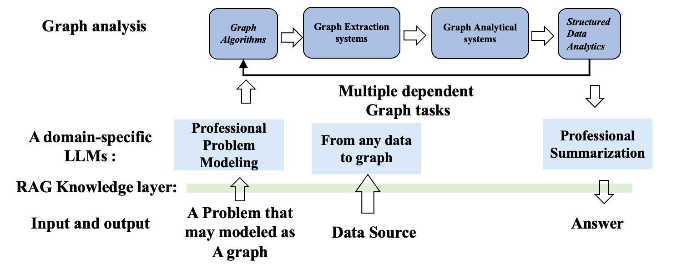

---

# GraphLLM: 面向图分析的LLM增强系统

## 项目简介

GraphLLM 是一个端到端的项目，旨在提升大语言模型（LLM）在图结构数据处理与分析方面的能力。该框架通过集成图分析系统、RAG（Retrieval-Augmented Generation）知识层和大模型推理，实现了从任意数据到图建模、图分析、专业问题建模与总结的全流程自动化，助力解决复杂的图相关问题。

---

## 架构总览

 

### 1. Graph Analysis 层
- **Graph Algorithms**：内置多种图算法（如PageRank、连通分量、中心性等），支持专业问题的图建模与分析。
- **Graph Extraction Systems**：支持从任意数据源自动抽取图结构。
- **Graph Analytical Systems**：对抽取的图进行进一步分析和处理。
- **Structured Data Analytics**：对结构化图数据进行专业总结和洞察输出。

### 2. RAG Knowledge Layer
- 作为知识增强层，负责将实际问题转化为图建模任务，并结合外部知识库辅助推理。

### 3. LLMs & Input/Output
- **专业问题建模**：将领域问题转化为图分析任务。
- **专业总结**：对分析结果进行专业化总结，输出最终答案。
- **输入/输出接口**：支持多种数据源输入和自然语言输出。

---

## 主要功能

- **图数据自动抽取**：支持从文本、表格、数据库等多种数据源自动构建图。
- **灵活的图算法执行**：内置多种常用图算法，支持自定义算法执行计划（plan）。
- **RAG知识增强**：结合外部知识库，提升LLM对图结构问题的理解与推理能力。
- **专业问题建模与总结**：支持领域专家级问题建模和结果总结。
- **多任务依赖与流水线**：支持多步依赖的图任务自动编排与执行。

---

## 快速开始

### 1. 安装依赖

```bash
pip install -r requirements.txt
```

---

## 目录结构

```
graphllm/
├── graph_engine/           # 图处理与分析核心
│   ├── graph_processor.py  # 图分析引擎（基于nextworkx）
├── data/                   # 收集论文
├── database/               # 数据库相关 (向量数据库milvus, 图数据库nebulagraph)
├── rag_engine/             # RAG引擎
├── model_deploy/           # LLM部署与推理
├── utils/                  # 工具函数
├── main.py                 # 主入口
└── requirements.txt        # 依赖列表
```

---

## 扩展性与定制化

- **算法扩展**：可继承 `GraphProcessor` 类，添加自定义图算法。
- **RAG集成**：可对接多种外部知识库，提升推理能力。
- **多任务流水线**：支持复杂依赖的图任务自动编排。

---

## 应用场景

- 金融风控中的关系网络分析
- 知识图谱自动构建与推理
- 社交网络分析与社区发现
- 供应链、物流等复杂网络建模
- 领域专家系统的自动化问题求解

---

## 贡献与反馈

欢迎提交 issue、PR 或建议，帮助我们完善 GraphLLM！

---

## 致谢

本项目受益于社区开源项目（如 networkx、llama-index、nebula3-python 等），感谢所有贡献者！


---

如需进一步帮助，请联系项目维护者或提交 issue。

